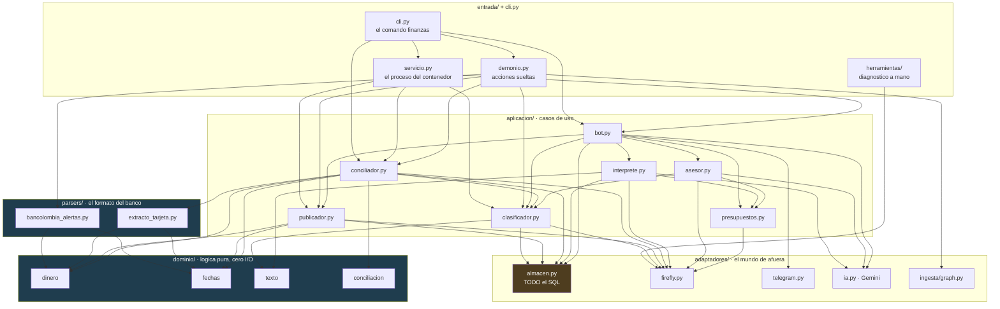
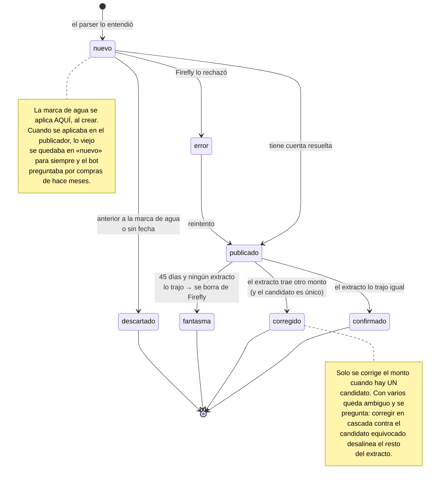
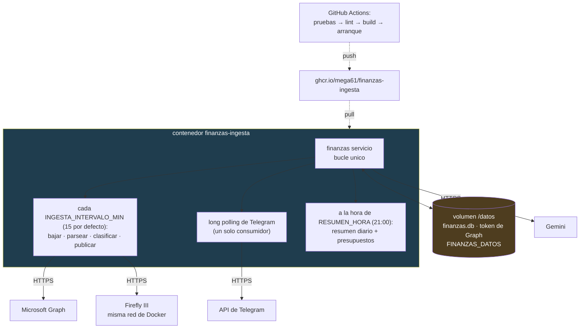

# Arquitectura

Cuatro vistas, de afuera hacia adentro: el recorrido de un movimiento, las capas
y quién puede llamar a quién, los estados por los que pasa un pendiente, y lo que
corre dentro del contenedor.

---

## 1. El recorrido de un movimiento

Desde que el banco manda el correo hasta que el movimiento queda cerrado. Las dos
flechas gruesas son las que llevan plata a Firefly.

```mermaid
flowchart LR
    subgraph afuera["  "]
        BANCO[Bancolombia<br/>alerta por correo]
        PDF[Extracto mensual<br/>PDF]
    end

    BANCO -->|Graph / IMAP| ING[ingesta<br/>guarda el correo crudo]
    ING --> PAR[parser<br/>monto, comercio, tarjeta]
    PAR --> CLA{clasificador<br/>¿sabe qué es?}

    CLA -->|sí, con confianza| PUB[publicador]
    CLA -->|no| COLA[(cola<br/>pregunta abierta)]

    PUB ==>|POST idempotente<br/>por external_id| FF[(Firefly III<br/>etiqueta sin-confirmar)]

    COLA --> BOT[bot de Telegram]
    BOT -->|botones o texto libre| VOS([vos])
    VOS -->|«fue la comida de la gata»| INT[intérprete + Gemini]
    INT --> REGLA[regla aprendida]
    REGLA --> PUB
    REGLA -.->|el mismo comercio<br/>no se vuelve a preguntar| CLA

    PDF --> EXT[parser de extracto]
    EXT --> CON{conciliador<br/>cruza libro vs extracto}
    FF --> CON
    CON ==>|corrige el monto| FF
    CON -->|no apareció en 45 días| FANT[fantasma:<br/>se borra de Firefly]

    style FF fill:#1f4e3d,color:#fff
    style VOS fill:#3d2f4e,color:#fff
    style COLA fill:#4e3d1f,color:#fff
```

**Por qué la cola existe.** Las alertas no son fuente de verdad para los montos:
las apps de transporte preautorizan un estimado y después cobran la tarifa real.
En el periodo que se midió, 13 de 30 alertas de viaje nunca se volvieron un cargo
real. Todo entra de una — etiquetado `sin-confirmar` — y el extracto es el que
manda al final.

---

## 2. Las capas, y quién puede llamar a quién

Cada caja es una carpeta de verdad dentro de `src/finanzas/`, y la regla es una
sola, verificada por `tests/test_arquitectura.py`: **las flechas solo bajan.**
Una capa depende de las de abajo, nunca de las de arriba, y el dominio no puede
importar nada que hable con el mundo.

(Están las llamadas principales, no las 60 aristas del grafo completo:
`config`, `registro` y `taxonomia` los lee casi todo el mundo y no se dibujan
para que el diagrama se pueda leer.)

No hay un solo ciclo de importación: el grafo es un DAG. Por eso los 25 imports
que estaban dentro de funciones «por si hay ciclos» subieron al tope — un import
adentro solo logra que una dependencia faltante explote a las 3am en el
contenedor en vez de al arrancar.

Tampoco queda un solo `sys.path.insert`. Los había en catorce archivos, y eran
el síntoma de que la mitad del código eran archivos sueltos que se buscaban
entre sí a mano en vez de ser un paquete instalado.

Del dominio no sale ni una flecha hacia arriba, y eso es lo que se verifica: no
puede importar el almacén, ni Firefly, ni Telegram, ni siquiera `config`.

Lo que **no** puede pasar, y falla el CI si pasa:

| Regla | Qué la rompía antes |
|---|---|
| El dominio no importa `sqlite3`, `db`, `firefly`, `telegram`, `requests`, `config` | La lógica de conciliación llevaba dos años sin una prueba porque hacía falta un Firefly andando para ejecutarla |
| Nadie ejecuta SQL fuera de `almacen.py` | 69 consultas en siete archivos, varias con la misma lógica escrita distinto |
| Nadie crea tablas en tiempo de ejecución | `bot.py` creaba tres con `CREATE TABLE IF NOT EXISTS`, así que `esquema.sql` no era la fuente de verdad |
| Ninguna capa importa de una de arriba | sin esto el grafo se vuelve una maraña y nada se puede probar por separado |
| No queda ningún `sys.path.insert` | catorce archivos remendaban el path para encontrarse entre sí |

---

## 3. Los estados de un pendiente

`estado` y `pregunta` son **columnas independientes**, y eso es a propósito: lo
normal es que un movimiento esté publicado en Firefly *y* con una pregunta
abierta al mismo tiempo.

La columna `pregunta` es aparte: `categoria`, `existencia` (¿es fantasma?) o
`monto`, y `NULL` cuando no hay nada que preguntar.

---

## 4. Lo que corre en el contenedor

Un solo proceso. Antes eran dos, y los dos hacían `getUpdates` contra Telegram,
que solo admite un consumidor: HTTP 409 permanente.

La base y el token viven en el volumen, nunca en la imagen. El contenedor corre
con un usuario sin privilegios: lee correo y tiene el token de Firefly.

No monta ningún archivo de configuración: **todo** entra por variables de
entorno, incluido `productos.csv`, que viaja como `PRODUCTOS_CSV` en una sola
línea. Eso es a propósito — un stack de repositorio no puede montar archivos
que el repo no tiene, y los secretos no están en el repo.

`docker exec -it finanzas_ingesta finanzas estado` es la forma rápida de ver qué
está pasando; `finanzas config` dice qué variables llegaron y a qué carpetas
está apuntando.

**Por qué la imagen se construye en el CI y no en el servidor.** Construir en el
servidor depende de que tenga salida a internet, memoria y disco justo en ese
momento, y cuando falla el error sale enterrado en el log de Portainer. El CI,
además, comprueba que la imagen *arranque* — eso atrapó un contenedor que llegó
a producción sin el paquete `finanzas` instalado.
