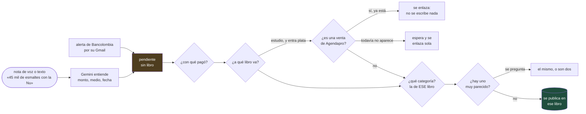

# Otra persona, con varios libros

Cómo se suma alguien más al bot: con su propio Firefly, y opcionalmente el
libro de su negocio en Actual Budget. Es el caso para el que se construyó:
una cuenta de ahorros que recibe a la vez el salario de la persona y los pagos
de las clientas de su negocio.

## La regla

**Nada llega a ningún libro hasta que la persona dice a cuál va.** Si tiene un
solo libro, el destino es obvio. Si tiene varios, el bot pregunta siempre, sin
excepción. La tarjeta, lo que dijo en un audio y lo que eligió la vez pasada
solo **preseleccionan** un botón (✓); nunca publican.

La regla vive en tres sitios, para que un camino nuevo que se olvide de
preguntar choque con alguno:

| Dónde | Qué hace |
|---|---|
| la base (`migraciones/001`, `002`) | un trigger rechaza marcar publicado un movimiento sin destino confirmado, o con el libro de otra persona |
| la cola (`pendientes_por_publicar`) | no ofrece lo que no tiene destino |
| el publicador | publica libro por libro, cada uno con **su** credencial, y se niega si el libro no es el del movimiento |

## El recorrido



- **Solo se ofrecen los libros donde el medio de pago tiene cuenta.** La
  tarjeta del estudio no tiene cuenta en el Firefly personal: ahí ni aparece.
- **Agendapro ya escribe las ventas.** El CRM sube cada noche los pagos de las
  clientas a Actual. Una transferencia que es una de esas ventas se **enlaza**;
  escribirla otra vez la contaría doble.
- **Un parecido no se descarta solo.** En un salón es normal comprar dos veces
  lo mismo el mismo día.
- **Cada respuesta se aprende para ese libro.** «Insumos» en el estudio no
  existe en el libro personal.

## Configurarla

Todo va en **un** lugar: `personas.toml` en la raíz del repo (está en
`.gitignore`). Ver `despliegue/personas.ejemplo.toml`. Los **secretos no van
ahí**: cada libro y buzón dice el *nombre* de la variable de entorno que lo
tiene, y un secreto pegado se rechaza.

```bash
finanzas revisar personas     # ¿contesta cada libro y cada buzón?
```

Verifica también que cada cuenta nombrada en `instrumento.cuentas` exista de
verdad en su libro.

### Actual Budget

Actual no tiene API REST. El stack trae el servicio `actual-api`
([jhonderson/actual-http-api](https://github.com/jhonderson/actual-http-api)):
la librería oficial de Node detrás de HTTP. Habla con el servidor de Actual por
su URL pública, así que en la VM de Actual no se abre nada.

- **`NODE_ENV=production` no se quita:** sin eso el puente no exige su llave.
- **La versión va fija y en sincronía** con el servidor de Actual y con el CRM
  (`automation/actual-sync`). El servidor corre con `:latest`: si se actualiza
  solo, el cliente puede dejar de entenderlo. Fija el servidor también.
- Se crea con `addTransactions`, no con `import`: `import` empareja por monto
  y fecha y fundiría el movimiento con una venta o con uno anotado a mano.

## Desplegar

1. `python herramientas/generar_variables.py` — el bloque para Portainer, con
   `PERSONAS_JSON` en una línea y `ACTUAL_API_URL` apuntando al servicio.
2. En Portainer: pegar las variables y redesplegar. Arranca el puente de Actual
   junto a la ingesta.
3. **Su chat de Telegram.** Que le escriba al bot. El log dice
   `mensaje ignorado, chat no autorizado: <id>`. Ese número va en
   `TELEGRAM_CHAT_ID_NOVIA`; redesplegar.
4. **En seco primero.** Los libros arrancan con `en_serio = false`: el bot
   pregunta todo y contesta «🧪 En prueba: lo guardaría en…», sin escribir.
   Cuando se vea bien, `en_serio = true` en `personas.toml`, regenerar y
   redesplegar. Lo que ya contestó en seco se publica en la siguiente pasada.

## El corte (cutover)

El saldo inicial se fija con los **extractos bancarios**, no a mano. Hasta el
corte, los saldos de sus libros no se usan para nada. Al hacerlo: el saldo de
la cuenta de ahorros al corte, la deuda de cada tarjeta, y el aporte histórico
de la dueña que cuadra Actual con el banco.

## Lo que todavía no hace

- **Un gasto del estudio pagado con la Nu** (o uno personal pagado con la
  tarjeta del estudio). Es un aporte de la dueña «en especie»: dos
  escrituras enlazadas, una en cada libro. Hoy el bot solo ofrece los libros
  donde el medio de pago tiene cuenta.
- **«Le pasé plata al estudio» / «me pagué del estudio».** Mismo mecanismo:
  un aporte o un pago de la dueña, sin movimiento en el banco.
- Editar desde el chat un movimiento ya guardado en Actual.
- El asesor («¿me alcanza para…?») y los productos del súper son de Juan.
